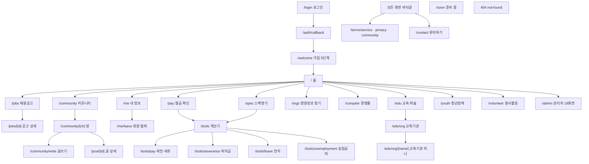

# POTJOB 새 앱(potjob-web) 정보구조·화면 스펙

작성 2026-10-08 · 대상 `web/` (Next.js 16.3.5 App Router · React 19 · Tailwind v4)
배포 주소 `https://potjob-web.vercel.app` (Vercel · 프로젝트 이름 `potjob-web`)
옛 앱 `https://potjob.co.kr` (GitHub Pages · 이 문서에서는 **7절에서 읽기만**)

이 문서는 **읽기만** 해서 만들었습니다. 코드·DB·설정을 하나도 바꾸지 않았습니다.
모든 줄은 실제 파일을 열어 확인한 것이고, 확인하지 못한 것은 **[미확인]** 으로 적었습니다.
[미확인] 은 모두 24곳이고 9절에 모아 두었습니다.

화면 수 — **회원·비회원 화면 30 · 관리자 화면 19 · 합 49**. 그 밖에 API 길 4개.

---

## 1. 서비스 한 줄 요약과 사용자 종류

**작업치료사·물리치료사의 채용공고를 한곳에 모으고, 급여·스펙·경쟁률을 같은 조건끼리 견줘 보게 하는 앱.**
공공기관·종합병원·대학병원 공고를 하나도 안 빼는 것이 목표입니다 (`CLAUDE.md` 1절).

사용자는 **셋**이 아니라 사실상 **넷**입니다. 코드가 「로그인했나」와 「가입을 마쳤나」를
따로 보기 때문입니다 (`app/auth.tsx:34` · `app/gate.tsx:36`).

| 누구 | 판정 | 볼 수 있는 것 | 못 보는 것 |
|---|---|---|---|
| 비회원 | `serverWho()` = `'비회원'` | 홈 전체 · 공고 **맛보기 몇 건** · 공고 상세(본문 제외) · 커뮤니티 글 읽기 · 경쟁률 **목록** · 교육 · 교육기관 · 봉사 · 청년정책 · 계산기 넷 · 약관 · 문의 | 공고 목록 전체·검색·필터·쪽넘기기 · 병원정보 · 경쟁률 **숫자** · 공고 상세 본문·병원 숫자 · 급여 내 위치 · 찜 · 알림 · 글쓰기·댓글 |
| 로그인했지만 가입 안 마침 | 세션 있음 + `profiles.survey_at` 비었음 (`설문 = '안마침'`) | 회원과 같은 **창구**는 열림. 화면에서 맛보기로 **잘립니다** (`Clip`) + 「3분 설문 마치고 전부 보기」 | 급여 내 위치 · 스펙 비교 (DB 가 막습니다) |
| 로그인 회원 (가입 마침) | `설문 = '마침'` | 전부 | 남의 급여 개별 금액 · 남의 스펙 (DB 가 막습니다) |
| 관리자 | `is_admin()` = true | 회원 전부 + `/admin/**` 19화면. **가입 설문을 안 마쳤어도 늘 전부 봅니다** (`app/gate.tsx:40`) | — |

「**모름**」이라는 **넷째 상태**가 하나 더 있습니다. 물어봤는데 답을 못 받은 때(연결 끊김·
토큰 갱신 실패)입니다. 이때 화면은 **가입 권유도 회원 자료도 안 그리고 자리를 비웁니다**
(`lib/supabase-server.ts:66` · `app/gate.tsx:39`). 2026-09-25에 이걸 안 가르다가
로그인한 회원에게 「가입하고 전부 보기」가 떴던 자리입니다.

막는 자리는 **화면이 아니라 DB** 입니다. 화면의 벽은 전부 **안내**입니다
(`app/gate.tsx:12` · `components/members-only.tsx:11`). 예 — 공고 목록은
`job_list()` 가 `auth.uid()` 없으면 **42501 권한없음** 을 돌려주고, 화면은 그 코드를
보고 안내 카드를 그립니다 (`app/jobs/page.tsx:138`).

---

## 2. 정보 구조 (IA)

### 2-1. 전체 화면 트리 — 그림



### 2-2. 전체 화면 트리 — 들여쓰기 목록

```
/                                 홈 (배너·카테고리·큰배너 + 랜딩 8구역)
├─ /jobs                          채용공고 목록·검색                      ★주 메뉴
│  └─ /jobs/[id]                  공고 상세 (공유 링크가 떨어지는 자리)
├─ /community                     커뮤니티 (여기만 어두운 바탕)            ★주 메뉴
│  ├─ /community/[ch]             방 하나 (16개 방)
│  └─ /community/write            글쓰기 (회원)
├─ /post/[id]                     글 상세 + 댓글
├─ /me                            내 정보 (회원)                          ★주 메뉴
│  └─ /me/leave                   회원 탈퇴
├─ /pay                           월급 확인
├─ /spec                          스펙쌓기
├─ /orgs                          병원정보 찾기 (?org= 이면 기관 상세)
├─ /compete                       경쟁률 찾아보기 (?g= 이면 한 묶음)
├─ /edu                           교육·학술
│  └─ /edu/org                    교육기관 목록
│     └─ /edu/org/[name]          교육기관 하나
├─ /youth                         청년정책 찾기
├─ /volunteer                     봉사활동 찾기
├─ /tools                         계산기 모음
│  ├─ /tools/pay                  세전 ↔ 세후
│  ├─ /tools/severance            퇴직금
│  ├─ /tools/leave                연차
│  └─ /tools/unemployment         실업급여
├─ /login                         로그인 (카카오·네이버·Apple자리)
│  └─ /auth/callback              로그인 되돌아오는 자리
│     └─ /welcome                 가입 5단계
├─ /terms/[doc]                   service · privacy · community
├─ /contact                       문의하기
├─ /soon                          준비 중 (지금은 아무도 안 보냅니다 ※4절)
├─ (404) not-found                없는 주소
└─ /admin                         관리자
   ├─ /admin            홈 꾸미기          ├─ /admin/hand       손으로 확인할 곳
   ├─ /admin/texts      홈 글             ├─ /admin/edu-orgs   교육기관
   ├─ /admin/jobs       공고              ├─ /admin/ads        오픈 화면 광고
   │  └─ /admin/jobs/[id] 공고 하나 고치기  ├─ /admin/beat       수집기 상태
   ├─ /admin/trash      쓰레기통          ├─ /admin/rival      경쟁사 비교
   ├─ /admin/boost      추천 올린 공고     ├─ /admin/members    회원
   ├─ /admin/posts      커뮤니티 글        ├─ /admin/reports    신고
   ├─ /admin/icons      아이콘            ├─ /admin/access     개인정보 접속기록
   ├─ /admin/stats      통계              └─ /admin/reset      내 계정 초기화
   └─ /admin/compete    경쟁률

API 길 (화면이 아닙니다)
   /api/hit                        화면 조회 기록 (page_hits)
   /api/og/job/[id]                카톡 미리보기 그림
   /api/post-image/[post]/[idx]    커뮤니티 글 사진
   /api/diag-who                   진단용 — 이 요청이 무엇을 들고 왔나
```

### 2-3. 주 메뉴

**아래 탭바 — 넷. 휴대폰에서만 보입니다** (`components/tab-bar.tsx:13`)

| 아이콘 | 이름 | 가는 곳 |
|---|---|---|
| house | 홈 | `/` |
| briefcase | 공고 | `/jobs` |
| message-circle | 커뮤니티 | `/community` |
| user-round | 내 정보 | `/me` |

**위쪽 줄 (데스크톱 md 이상)** — 같은 목록의 **2·3번만** 씁니다
(`components/tab-bar.tsx:74` · `TABS.slice(1, 3)`). 즉 데스크톱 위쪽에는
**공고 · 커뮤니티 둘뿐**이고 「내 정보」는 오른쪽 아바타로 갑니다
(`components/topbar-user.tsx:51`).

**탑바 (모든 화면 · 56px 고정)** — 로고(→`/`) · 위쪽 줄 · 오른쪽 사용자 칸.
오른쪽 칸은 네 모양입니다 — 확인중 `…` / 비회원 「로그인」 / 로그인했지만 가입 안 마침
**「로그인」(같은 글자)** / 회원 아바타+닉네임+직군배지(+관리자면 빨간 「관리자」 단추).

**바닥글 (모든 화면)** — 직업정보제공사업 신고번호 · 회사·주소 · 개인정보 보호책임자 ·
이용약관 / **개인정보처리방침(굵게)** / 커뮤니티 이용규칙 / 문의하기
(`app/layout.tsx:83`). 휴대폰에서 탭바에 안 가리게 `pb-[78px]`.

### 2-4. 각 화면으로 들어오는 길 (진입점)

| 화면 | 들어오는 길 |
|---|---|
| `/jobs` | 탭바 · 위쪽 줄 · 홈 카테고리(DB) · 홈 큰배너(DB) · 홈 히어로 둘째 단추 · `/soon` · 404 · 공고 상세 「← 목록으로」 · 마감 공고의 「비슷한 공고 보기」 |
| `/jobs/[id]` | 목록 줄 · 맛보기 줄 · **카톡·문자 공유 링크** · 기관 패널의 다른 공고 · `/me` 찜 목록 |
| `/community` | 탭바 · 위쪽 줄 · 홈 카테고리(DB) · `/soon` · 404 · 글 상세 「← 방」 |
| `/pay` | 홈 히어로 **첫 단추** · 홈 카테고리(DB) · `/spec` 아래 링크 |
| `/spec` | 홈 카테고리(DB) · `/pay`→`/tools` 는 있는데 `/pay`→`/spec` **직접 링크는 없습니다** |
| `/orgs` | 홈 카테고리(DB) · 공고 상세 기관 패널 |
| `/compete` | 홈 「더 찾아보기」 셋째 칸 · `lib/routes.ts` |
| `/edu` · `/youth` | 홈 「더 찾아보기」 첫째·둘째 칸 |
| `/edu/org` | `/edu` 안 링크 · `lib/routes.ts` |
| `/volunteer` | `lib/routes.ts` 에만 있습니다 — **홈 「더 찾아보기」에 없습니다** (※5절) |
| `/tools` | `/pay` 아래 카드 · `/spec` 아래 카드 · `lib/routes.ts` |
| `/login` | 탑바 · 회원 벽 카드 · `/me`·`/welcome`·`/community/write` 되돌림 |
| `/welcome` | `/auth/callback` (프로필 없으면) · 탑바·`/login`「이어서 하기」 · **홈 마지막 CTA(무조건)** |
| `/me` | 탭바 · 탑바 아바타 |
| `/terms/*` · `/contact` | 모든 화면 바닥글 · `/welcome` 약관 단계 |
| `/soon` | **지금 아무도 안 보냅니다** — `lib/routes.ts` 에 `soon` 값이 한 줄도 없습니다 (※5절) |
| `/admin` | 탑바 빨간 「관리자」 단추 (관리자만 보입니다) |

### 2-5. 홈에서 갈 수 있는 곳은 코드가 정합니다

관리자가 `/admin` 에서 배너·카테고리·큰배너의 **가는 곳을 직접 적을 수 없습니다.**
`lib/routes.ts:9` 의 **13줄 목록에서만 고릅니다**. 목록에 없는 주소는 `safeHref()` 가
홈으로 되돌립니다 (`lib/routes.ts:29`). 없는 화면으로 보내 404 를 내지 않으려는 자리입니다.

```
/ · /jobs · /jobs?sort=deadline · /community · /pay · /spec · /orgs
/volunteer · /edu · /edu/org · /youth · /compete · /tools
```

### 2-6. 공고 분류 체계

**① 탭 — 화면은 넷, DB 값은 여섯** (`lib/supabase.ts:114`)

| 탭 키 | 화면 이름 | DB `job_posts.tab` 과 맞추는 법 |
|---|---|---|
| `public` | 공공기관·대학·종합 | `like '공공기관·대학·종합%'` ← **DB 에는 ` · 공공` / ` · 종합` / ` · 대학` 셋** |
| `rehab` | 재활·요양병원·의원 | `=` 와 같음 |
| `child` | 아동·정신센터 | `=` 와 같음 |
| `ltc` | 요양원·노인센터 | `=` 와 같음 |

`eq` 가 아니라 `like` 인 이유가 여기 있습니다. 「1층」은 `public` 탭이고
「2층」은 나머지 셋입니다 (`CLAUDE.md` 1절). 탭 건수를 **더하면 안 됩니다** —
탭이 빈 공고가 네 탭에 다 들어가서 합이 전체보다 큽니다. `job_counts` 가
겹치지 않게 센 `(전체)` 를 따로 보냅니다 (`app/jobs/page.tsx:162`).

**② 직군** — `작업치료사` · `물리치료사` 둘뿐 (`lib/who.ts:9`).
목록 기본값은 **회원이 가입 때 고른 직군**이고, 주소에 `job=전체` 를 쓰면 전체입니다.
비로그인은 전체입니다 (`app/jobs/page.tsx:114`).

**③ 지역** — 시·도 17개 한 벌 (`lib/org.ts:33`). 화면에 또 적어 두지 않습니다
(2026-09-25에 두 곳 순서가 달랐던 자리).

**④ 정렬 넷** (`app/jobs/page.tsx:190`) — 추천순(기본·주소에 `sort` 없음) ·
최신순 `new` · 마감순 `deadline` · 조회순 `views`. 순서의 **뜻은 DB `job_list(p_sort)`**
한 곳에서 정하고 화면은 이름표만 가집니다.

**⑤ 마감된 것도 보기** — `past=1` (옛 이름 `all` 도 **같이 읽습니다** — 밖에 나간
링크가 안 깨지게 · `app/jobs/page.tsx:92`).

**⑥ 역할** — `현직` · `학생` (`lib/who.ts:10`). 커뮤니티 방 갈래와 안내 글귀에만 씁니다.

---

## 3. 화면 스펙

아래 틀을 **같게** 씁니다. 회원이 매일 보는 큰 화면 10개는 전부 적고,
나머지와 관리자 화면은 **같은 항목을 한 줄씩** 적습니다 — 틀은 같고 길이만 다릅니다.

### 3-1. 홈 `/`

- **경로 / 이름 / 목적** — `/` · 홈 · 늘 쓰던 홈을 먼저 보여주고, 내리면 서비스 소개가 이어집니다
- **누가** — 누구나. 로그인 벽 **없음**
- **들어오는 길** — 탭바 「홈」 · 탑바 로고 · 뒤로가기 가드가 지키는 자리 · 404·`/soon` 의 「홈으로」
- **나가는 길** — 배너(DB) · 카테고리 5칸(DB) · 「더 찾아보기」 3칸(코드) · 큰배너(DB) ·
  히어로 단추 둘(`/pay`·`/jobs`) · 마지막 CTA(`/welcome`)
- **구성 요소 (위 → 아래)**
  1. 오픈 화면 (`Splash` · 이번 방문 첫 진입에만 · 광고가 걸려 있으면 `SplashAd` 가 덮습니다)
  2. 상단 배너 — 옆으로 넘김 · 자동 넘김 초는 `site_settings.top_banner_seconds`
  3. 큰 카테고리 **5칸 격자** — DB(`home_blocks kind='category'`)
  4. **「더 찾아보기」 2열** — **코드에 박혀 있습니다** (교육·학술 / 청년정책 / 경쟁률)
  5. 큰 배너 — 옆으로 미는 레일 · 카드 폭이 줄 폭 −40px 라 다음 카드가 25px 만 보입니다
  6. 히어로 (여기만 어두움 `#14181C`) — 눈썹 · 큰 제목(관리자가 줄바꿈 직접) · 단추 둘 · 숫자 3칸
  7. 참여 현황 → 급여 01~05 → 취업·이직 06~09 → 함께 만듭니다 → 익명 → 이용 방법
  8. 마지막 CTA (어두움) + 출처
- **데이터와 출처** — `getHome()` (`lib/home.ts:63`) 이 **일곱을 한 번에** 부릅니다:
  `home_blocks` · `site_settings` · `job_totals()` · `org_total()` · `공개글`(인기글 1건) ·
  `home_stats()` · `home_texts`. **화면에 뜨는 숫자는 코드에 하나도 없습니다.**
  문구는 `home_texts` → 없으면 `lib/home-text.ts` 의 기본값
- **상태** — 로딩: **없습니다** (서버가 다 받아 한 번에 보냅니다 · `loading.tsx` 없음) ·
  빈 화면: 배너·카테고리·큰배너는 **0건이면 그 구역을 아예 안 그립니다** ·
  숫자가 안 쌓이면 히어로 숫자 칸이 **줄어듭니다** (`components/home/hero.tsx:28`) ·
  오류: DB 를 못 읽어도 **홈이 비지 않습니다** (기본 문구로 그립니다 · `lib/home.ts:86`)
- **동작** — 배너 밀기 · 카테고리 누르기 · 레일 밀기(scroll-snap) · 숫자가 0에서 세어 올라감
  (`useCountUp` · 한 번만)
- **이 화면 규칙** — 가는 곳은 `safeHref()` 를 지난 것만 · 큰배너 한 줄은 `metric`
  (`deadline`/`coverage`/`hot`) 이 있으면 DB 숫자로, 없으면 관리자 설명 그대로 ·
  히어로 중위값 아래에는 **늘 `PayNote`** (근거 없는 숫자를 안 냅니다)
- **파일** — `app/page.tsx:30` · `components/home/hero.tsx` · `components/home/sections.tsx` ·
  `components/home-banner.tsx` · `components/rail.tsx` · `lib/home.ts` · `lib/home-text.ts`
- **캡처** — [home.png](screens/home.png)

### 3-2. 채용공고 목록 `/jobs`

- **경로 / 이름 / 목적** — `/jobs` · 채용공고 · 공고를 탭·직군·지역·정렬로 찾습니다
- **누가** — **목록 전체는 회원만.** 비회원에게는 **최신 맛보기 몇 건**(`공개공고()`) +
  회원 벽 카드. 로그인 벽은 **DB** 입니다 — `job_list()` 가 `auth.uid()` 없으면
  42501 을 돌려주고 화면이 그 코드로 가립니다 (`app/jobs/page.tsx:138`)
- **들어오는 길 / 나가는 길** — 2-4 표 참고 / 줄을 누르면 `/jobs/[id]`
- **구성 요소 (위 → 아래)**
  1. 제목 — `sort=deadline` 이면 「마감 임박 공고」로 **제목까지 바뀝니다**
  2. 정렬 4개 (그냥 링크 — 자바스크립트 없이도 됩니다)
  3. 검색 — **GET 폼** (`action="/jobs" method="get"`)
  4. 검색 중이 아니면 **분류 카드 4장**(옆으로 미는 레일 · 관리자가 올린 그림 + 건수) ·
     검색 중이면 「`검색어` — 공고 N건에서 찾았어요 / 검색 지우기」
  5. 거르기 줄 `ListFilters` — 직군 드롭다운 · 지역 드롭다운 · 「마감된 것도」 체크박스
  6. (검색 중 + 회원) 기관 카드 `OrgCard`
  7. 공고 줄 (divide-y · 테두리 없음)
  8. 쪽 넘기기 ← 앞쪽 / N쪽 / 다음쪽 →
  9. 「공공기관·대학·종합 N건 중 이 쪽에 M건 · 한 번에 20건씩 보여드려요」
- **데이터와 출처** — `job_list(p_job,p_sido,p_tab,p_q,p_all,p_sort,p_page)` ·
  `job_counts(...)` · `job_tab_cards`(그림 · 누구나) · `내프로필()`(직군 기본값) ·
  `job_views()`(지금 화면에 뜨는 것만) · 비회원은 `공개공고()`.
  **`profiles` 를 직접 읽으면 안 됩니다** — 표 권한이 없어 늘 빈 값이 옵니다
  (`app/jobs/page.tsx:99`)
- **상태**
  - 로딩 — **없습니다.** 서버가 다 받을 때까지 **앞 화면이 그대로 멈춰 있습니다** (※5절)
  - 비회원 — 맛보기 줄 + 「로그인하면 공고 N건을 다 볼 수 있어요」 (`MembersOnly`)
  - 빈 화면 — 검색 중 「「검색어」 로 찾은 공고가 없어요」 / 2쪽 이상 「이 쪽에는 공고가 없어요」 / 그 밖 「조건에 맞는 공고가 없어요」
  - 오류 — 「공고를 불러오지 못했어요 — (DB 가 준 말 그대로)」 빨간 면
  - 마감된 공고 — 목록에서는 기본으로 **안 보입니다.** 「마감된 것도」를 켜면
    오른쪽 꼬리표가 회색 「마감」
- **동작** — 정렬·탭·필터·쪽 전부 **주소를 바꿉니다** → 뒤로가기·공유에서 유지됩니다.
  조건을 바꾸면 쪽 번호가 **처음으로 돌아갑니다** (`app/jobs/page.tsx:177`)
- **이 화면 규칙** (2026-10-07 확정)
  - 카드 아래 줄은 **직군 · 지역 · 고용형태 · 공고 기간 · 조회수** 로 **고정**.
    공고마다 칸을 빼거나 더하지 않습니다
  - **지역은 `지역보임`** 을 읽습니다 — 제목과 **같은 계산**. `work_place` 를 그대로 쓰면
    순천병원이 「전남광주」로 나옵니다
  - **모집 인원은 아래 줄에서 뺐습니다** (상세의 「모집 인원」 칸에 있습니다)
  - 고용형태가 비면 칸을 비우지 않고 **「공고문 참고」**
  - 마감일이 없을 때 쓸 말은 **화면이 정하지 않습니다** — DB `마감표시()` 가 정해
    `job_list` 가 「마감표시」 칸으로 내려 줍니다. 비어 있으면 날수를 셉니다
  - **마감 시각까지 봅니다** — `isClosed()` 한 곳에서만 판정 (DB `마감지났나()` 와 같은 기준).
    오늘 마감이고 시각이 있으면 「오늘 17:30 마감」
  - 배지 — 「추천」(DB `job_list.올림`) · 「체험형 인턴」(DB `is_intern`). 둘 다 **DB 가 판단**
  - D-day 색 — 마감 `text-mute` / 3일 이내 `text-brand-red` / 그 밖 `text-gray-600`
- **파일** — `app/jobs/page.tsx` (`dday` 57 · 맛보기 149 · 줄 343 · 아래줄 389) ·
  `components/job-tabs.tsx` · `components/list-filters.tsx` · `components/members-only.tsx` ·
  `lib/job-state.ts` · `lib/job-views.ts`
- **캡처** — [jobs-비회원.png](screens/jobs-비회원.png) · 회원 상태는 **[캡처 없음]**
  (실제 회원 계정을 쓰지 않습니다 · 작업지침 8-9)

### 3-3. 공고 상세 `/jobs/[id]`

- **목적** — 공고 한 건을 끝까지 보여주고 원문으로 보냅니다. **공유 링크가 떨어지는 자리**
- **누가** — **누구나 열립니다** (공유 링크가 살아야 하므로). 다만 **본문·병원 숫자는
  회원에게만 실려 옵니다** — 비회원에게는 DB 가 빈 것을 줍니다. 가입을 안 마친 회원은
  `JobVeil` 이 흐립니다
- **들어오는 길 / 나가는 길** — 목록·맛보기·공유 링크·기관 패널 / 「← 목록으로」 ·
  「지원하러 가기」(원문 · 새 창) · 「기관 홈페이지 열기」 · 마감이면 「비슷한 공고 보기」
- **구성 요소 (위 → 아래)**
  1. 상단바 — ← 목록으로 · 찜 · 공유
  2. **마감 띠** (마감이면 제일 위 · `JobClosed`) — 이 아래 전체가 `opacity-[0.55]`
  3. 머리 — 배지줄(직군 · 고용형태 · D-day) · 제목 · **기관 원문 제목**(다르면) ·
     기관 · 지역 · 조회수
  4. **핵심 네 칸** 2열 — 모집 인원 / 접수 마감 / 학력 / 근무지
  5. (오늘 마감 + 시각) 「오늘 오전 9시에 마감됩니다」 한 줄 (지났으면 「마감됐습니다」)
  6. 마감일 없음 안내 **두 갈래** — `마감표시 = '수시채용'` 이면 수시 안내 /
     아니면 「접수 마감일을 아직 확인하지 못했습니다 … 저희도 다시 읽어 채워 넣겠습니다」
  7. (회원) 병원 뜯어보기 · 얼마나 바쁜 곳인지
  8. (회원) 지원 자격 · 전형 방법 · 내야 하는 것 · 그 밖 칸들
  9. 출처 밝힘 → 오류 신고 → 기관 홈페이지 → 기관 패널(`OrgPanel`)
  10. **하단 고정 줄** — 찜 + 「지원하러 가기」. 마감이면 **없습니다**
- **데이터와 출처** — `job_one(p_id)` · `공고원문제목(p_id)` ·
  `org_hospital_by_name()`(회원만 · `lib/hospital.ts`) · `iconMap('공고 상세')`(`ui_icons`) ·
  `job_views()`. 미리보기 그림은 `/api/og/job/[id]` → `job_one` (세션 없는 공개 열쇠)
- **상태** — 로딩 없음 · 없는 공고 `notFound()` → 404 화면 · 비회원 `MembersOnly` 카드 ·
  모름 **아무것도 안 그림** · 본문을 못 받아온 공고 「이 공고는 본문을 못 받아왔어요」 ·
  병원 자료 없으면 그 **구역을 통째로 감춤**(0 으로 채우면 「치료사가 없는 병원」으로 읽힙니다)
- **이 화면 규칙** — 전형방법은 2~8 조각으로 끊기면 `01 02 03` 번호 목록, 못 끊으면 통째로 ·
  **워크넷(`id` 가 `WN` 로 시작) 공고의 「연봉」 칸에만** 「1호봉 예정 급여이며…」 한 줄 ·
  배지 색은 직군별(`JOB_COLOR`)이고 **마감이면 회색 `#8A9299`**
- **파일** — `app/jobs/[id]/page.tsx` (머리 170 · 핵심칸 238 · 수시 안내 286 · 하단 고정 490) ·
  `components/job-veil.tsx` · `components/job-closed.tsx` · `components/job-hospital.tsx` ·
  `components/job-busy.tsx` · `components/org-panel.tsx` · `components/job-report.tsx`
- **캡처** — [job-상세-비회원.png](screens/job-상세-비회원.png) ·
  회원 전용 구역(병원 뜯어보기·지원 자격)은 **[캡처 없음]**

### 3-4. 경쟁률 찾아보기 `/compete`

- **목적** — 공공기관이 알리오에 공개한 **지난 채용의 경쟁률**을 자리별로 봅니다
- **누가** — **목록은 누구나 · 숫자는 회원만** (2026-10-05 세중님 결정).
  **화면에서 가리지 않습니다** — 목록 함수 `경쟁률찾기목록()` 이 평균·가장높음·가장낮음을
  **아예 안 내보냅니다**. 숫자는 `경쟁률한묶음()` 이 첫 줄에서 `auth.uid()` 를 보고 줍니다
- **구성 요소** — 제목(+「숫자는 **로그인하면** 보여요」) · 거르기 줄 · 묶음 줄 목록
  (기관 작게 → 직군 크게 → 꼬리표 · 「경쟁률 보기」 / 「로그인하면 경쟁률을 볼 수 있어요」) ·
  쪽 넘기기 · **출처와 한계 밝힘(늘 붙습니다)**. `?g=` 이면 그 묶음 한 장 (요약문 + 회차 목록)
- **데이터와 출처** — `경쟁률찾기목록(p_직군,p_지역,p_기관,p_찾기,p_쪽)` · `경쟁률한묶음(p_묶음키)`.
  주간 1회(수 03:15) `~/경쟁률크론.sh` 가 담은 것만 읽습니다
- **상태** — 오류 「목록을 못 읽었어요 — …」 · 빈 「고른 조건에 맞는 자리가 없어요.」 ·
  비회원이 묶음을 열면 「로그인하면 경쟁률을 볼 수 있어요」 카드 + 로그인 단추
- **이 화면 규칙** — 회차 경쟁률 칸이 **네 갈래**이고 뜻이 다 다릅니다:
  ① 지원자 0명 → 「0 : 1」 ② 지원자 있고 선발 0명 → **「지원 N명 · 선발 0명」**
  (「0 대 1」로 적으면 뜻이 반대가 됩니다) ③ 기관이 숫자를 안 적음 → 「기관이 숫자를
  안 적었어요」(**0 이 아니라 모르는 것**) ④ 그 밖 「경쟁률을 낼 값이 없어요」.
  한 번뿐이면 「평균」을 **안 씁니다**. 222묶음만 내보냅니다 (짝 확인 필요 39 · 고용형태 모름 2 등 제외)
- **파일** — `app/compete/page.tsx` (요약문 80 · 률칸 104 · 밝힘 122 · 머리 190)
- **캡처** — [compete.png](screens/compete.png) · 회원 숫자 화면 **[캡처 없음]**

### 3-5. 월급 확인 `/pay`

- **목적** — 치료사들이 직접 올린 급여를 같은 조건끼리 비교합니다
- **누가** — 누구나 봅니다. **내 위치**만 급여를 등록한 회원에게 나옵니다
- **구성 요소** — 제목 · 조건 5칸(직군·지역·기관 유형·연차·고용형태) · 내 위치(`PayRank`)
  또는 「내 위치도 보고 싶으세요?」 · 연 총소득 카드 · 고정 월급 카드 · 고용형태 분포
  (막대) · 「지금 N명」 표본 막대 · 「계산기 보기」 카드 · `PayNote`
- **데이터와 출처** — `pay_stats(p_job,p_region,p_type,p_band,p_employ)` 하나.
  회원은 `salary_records` 를 **아예 못 읽습니다**
- **상태** — 이 화면은 **`'use client'`** 입니다 — 껍데기가 먼저 뜨고 「세는 중이에요…」가
  보입니다 (※5절의 빠른 쪽) · 오류 「불러오지 못했어요 — …」 ·
  **표본 미달** 「아직 숫자를 못 보여드려요 — 이 조건에 N명뿐이에요. M명이 안 되면
  누가 적었는지 짐작될 수 있어서 숫자를 안 내보내요」 (막는 자리는 `pay_stats` 함수 안)
- **이 화면 규칙** — **연 총소득이 기준**입니다 (월급만 비교하면 상여 있는 곳과 없는 곳이
  같아 보입니다) · 숫자 옆에 **늘 근거**를 적습니다 (「같은 조건 N명 중」) ·
  「병원 이름은 받지 않아요」
- **파일** — `app/pay/page.tsx` · `components/pay-rank.tsx` · `components/pay-note.tsx` · `lib/pay.ts`
- **캡처** — [pay.png](screens/pay.png)

### 3-6. 스펙쌓기 `/spec`

- **목적** — 학생이 자기 스펙을 또래·현직과 견줍니다
- **누가** — 누구나 열리지만 **스펙을 적은 회원**에게만 값이 나옵니다
- **구성 요소** — 제목 · (안 적었으면)「스펙을 아직 안 적으셨어요」 · 총점 · 내가 넣은 것 ·
  합격한 사람들과 비교 · 다음에 챙길 것 · 「여기 가면 얼마 받나요」 · 계산기 카드
- **데이터와 출처** — `spec_stats()` · `rookie_salary()`. 점수 계산은 **DB `spec_parts()`
  한 곳에만** 있고 화면에서 다시 계산하지 않습니다
- **이 화면 규칙** — **배점을 화면에 한 자도 안 내보냅니다** (2026-09-23). 항목별 점수 표기 ·
  항목별 막대(길이로 배점이 역산됩니다) · 「꽉 채우면 N점」 · 배점표 전부 뺐습니다.
  현직 비교는 **20명**은 쌓여야 내보냅니다
- **파일** — `app/spec/page.tsx` · `lib/spec.ts` · `lib/spec-weights.ts`
- **캡처** — [spec.png](screens/spec.png)

### 3-7. 병원정보 찾기 `/orgs`

- **목적** — 치료사가 일하는 곳을 이름·종별·지역으로 찾습니다. `?org=` 이면 **기관 상세**
- **누가** — **회원만.** 거르기 목록조차 회원만입니다 (`org_facets` 실행 권한을 걷었습니다)
- **왜 주소 조각이 아니라 `?org=`** — 기관 이름에 빗금·물음표가 든 곳이 10곳 있고,
  같은 이름이 자료 두 곳에 있는 경우도 있습니다
- **구성 요소** — 목록: 제목 · 검색(`OrgSearch`) · 종별 타일 · 시도/시군구 ·
  기관 줄(치료사 인원 칩 작업/물리/재활의학과) / 상세: `OrgDetail` (하단 고정 줄 있음)
- **데이터와 출처** — `org_facets()` · `org_search()` · `org_detail()` · `org_public()` ·
  `org_jobs()` · `org_nearby()` · `org_total()`(비회원도 부를 수 있게 열어 둠 · 줄이 안 나갑니다)
- **상태** — 모름 → **`return null`** (빈 화면) · 비회원 → 제목 + `MembersOnly`
  「병원정보는 회원만 볼 수 있어요 … N곳」 · 상세는 `Suspense` 로 「불러오는 중이에요…」
  (**이 앱에서 로딩 글귀가 있는 거의 유일한 자리**)
- **파일** — `app/orgs/page.tsx:51` · `components/org-search.tsx` · `components/org-detail.tsx` · `lib/org.ts`
- **캡처** — [orgs-비회원.png](screens/orgs-비회원.png) · 회원 목록·상세 **[캡처 없음]**

### 3-8. 커뮤니티 `/community`

- **목적** — 치료사끼리 묻고 답하는 곳
- **누가** — 읽기는 **누구나**. 글쓰기·댓글·좋아요는 회원
- **여기만 어둡습니다** — 바탕 `#14181C` · 카드 `#1B2025`.
  `app/surface.tsx` 가 `html[data-surface="dark"]` 를 답니다.
  **커뮤니티만 어둡고 그 밖에는 기기 설정과 무관하게 전부 밝습니다** (2026-10-03 세중님 결정)
- **구성 요소** — 배너(DB `kind='comm'`) · 제목 · **방 목록 3묶음**(둘 다 / 치료사 / 학생 ·
  각 묶음이 옆으로 미는 레일 · 방마다 글 수) · 「지금 많이 본 글(최근 7일)」 5건 · 「새 글」 20건
- **데이터와 출처** — `공개글` 보기(회원번호를 안 받습니다 · 2026-10-07) ·
  `commBanners()` → `home_blocks` + `site_settings.comm_banner_seconds`
- **상태** — 빈 「아직 글이 없어요. 첫 글을 써보세요」 · 인기글 0건이면 그 구역을 안 그림
- **이 화면 규칙** — 어두운 구역에서 보조 글자를 `#9BA3AB` 보다 연하게 쓰지 않습니다.
  화면마다 클래스를 바꾸지 않고 `globals.css` 가 그 구역의 토큰 값을 갈아 끼웁니다
- **파일** — `app/community/page.tsx` · `lib/channels.ts`(방 16개) · `components/post-row.tsx`
- **캡처** — [community.png](screens/community.png)

### 3-9. 커뮤니티 방 `/community/[ch]`

- **목적** — 방 하나의 글 목록 · **누가** 읽기 누구나 / 글쓰기 회원 ·
  **들어오는 길** `/community` 방 카드 · **나가는 길** 「← 방 고르기」 · 글 줄 → `/post/[id]` ·
  「글쓰기」 → `/community/write?ch=`
- **구성 요소** — ← 방 고르기 · 방 이름·설명 · 정렬 칩(최신 / 많이 본) · 글쓰기 단추 · 글 줄 50건
- **데이터** — `공개글` + `POST_LIST_COLS` · `channel = ch` · 50건
- **상태** — 없는 방 `notFound()` · 오류 「글을 불러오지 못했어요 — …」 ·
  빈 「아직 글이 없어요. 첫 글을 써보세요」
- **규칙** — 방 `id` 는 **바꾸면 안 됩니다** (옛 시트 글의 `posts.channel` 과 같아야 합니다)
- **파일** — `app/community/[ch]/page.tsx`
- **캡처** — [community-방.png](screens/community-방.png)

### 3-10. 글 상세 `/post/[id]`

- **목적** — 글 한 건 + 댓글 · **누가** 읽기 누구나 / 댓글·좋아요·신고 회원 ·
  **들어오는 길** 방·인기글·공유 링크·`/me` 내 글
- **구성 요소** — ← 방 이름 · 제목 · 본문 · 사진(있으면) · 글쓴이·시각·조회수 ·
  `PostActions`(좋아요·신고·내 글이면 감추기) · `PostComments` · `ViewBump`(조회수 +1)
- **데이터** — `공개글`+`POST_ONE_COLS` · `post_state(p_id)` · `글사진(p_post)` ·
  `공개댓글` · `bump_post_view()`
- **상태** — **「없는 글」과 「지워진 글」을 갈라 말합니다** — 그래서 `not-found.tsx` 로
  안 보내고 이 파일이 직접 `NothingHere` 를 그립니다 (`app/post/[id]/page.tsx:44`)
- **규칙** — 글쓴이 이름은 **반드시 `shownName()`** 을 거칩니다. 탈퇴한 분은 「탈퇴한 회원」,
  줄이 없으면 「알 수 없음」. `nickname` 에 든 「지운계정-…」 을 그대로 내보내면 안 됩니다
- **파일** — `app/post/[id]/page.tsx` · `components/post-actions.tsx` ·
  `components/post-comments.tsx` · `lib/who.ts:38`
- **캡처** — [post-상세-비회원.png](screens/post-상세-비회원.png)

### 3-11. 그 밖 회원·비회원 화면 (같은 틀 · 한 줄씩)

| 경로 / 이름 | 목적 | 누가 | 들어오는 길 → 나가는 길 | 구성 요소 | 데이터 출처 | 상태 (로딩/빈/오류/로그인) | 규칙 · 파일 |
|---|---|---|---|---|---|---|---|
| `/community/write` 글쓰기 | 글·사진 올리기 | **회원만** (`!session`→`/login` · `!me`→`/welcome`) | 방 「글쓰기」 → `/post/[id]` | 방 고르기 · 제목 · 본문 · 사진 최대 N장 · 올리기 | `posts` insert · `post-images` 저장소 · `post_images` | 확인중 자리 비움 · 되돌림 전 `sessionStorage` 에 돌아올 주소 저장 | **역할로 방을 거릅니다** (`channelsFor(me.role)`) · `app/community/write/page.tsx:43` · **[캡처 없음]** |
| `/login` 로그인 | 소셜 로그인 | 누구나 | 탑바·회원 벽·되돌림 → `/auth/callback` | 로고 · 카카오 · 네이버 · Apple(꺼짐) | `signInWithOAuth` · `lib/last-login.ts`(이 기기에만) | **확인 중에는 아무것도 안 그립니다** · 실패하면 **진짜 이유를 그대로** 보여줍니다 · 이미 로그인 「이미 로그인되어 있어요 — N 님」 · 가입 중단 「가입을 하다가 멈추셨어요」 | **마지막에 쓴 수단을 맨 위로 올리고 숨 쉬는 테두리** (계정이 갈라지는 것을 막습니다) · 카카오·네이버 색은 **그 회사 값** 그대로 · `app/login/page.tsx` · [login.png](screens/login.png) |
| `/auth/callback` 되돌아오는 자리 | 세션 받고 길 정하기 | 로그인 직후 | `/login` → `profiles` 있으면 원래 가려던 곳(`/`), 없으면 `/welcome` | 글귀만 | `getSession()` · `profiles` 1줄 | 주소에 `error_description` 이 실려 오면(동의 취소) 그걸 보여줍니다 | `app/auth/callback/page.tsx:75` · **[캡처 없음]** |
| `/welcome` 가입 | 5단계 가입 | 로그인 필요 (`!session`→`/login`) | `/auth/callback`·탑바·홈 마지막 CTA → `/` | ①약관 ②직군·역할 ③닉네임 ④사진 ⑤급여·스펙 설문 | `profiles` insert · `동의남기기()` · `save_my_survey()` · `notification_settings` | 채운 데까지 보고 **그 자리를 엽니다** (`resume`) · 이미 마쳤으면 `router.replace('/')` ※5절 | 동의는 **문서별로** 남깁니다 (`terms_version` 한 칸으로는 어느 문서인지 모릅니다) · 거절한 선택항목도 `false` 로 남깁니다 · `app/welcome/page.tsx:50` · **[캡처 없음]** |
| `/me` 내 정보 | 프로필·알림·내 글 | **회원만** (`!session`→`/login` · `!me`→`/welcome`) | 탭바·탑바 아바타 → `/me/leave` | 사진 · 닉네임(5번 눈금) · 직군·역할 · 설문 고치기 · 내 목록 · 알림 · 로그아웃 · 회원 탈퇴 | `profiles` update · `내프로필()` · `job_stars`·`posts`·`comments` · `알림기기등록()` | 확인중 「잠시만요…」 | **칸마다 따로 저장됩니다** · 닉네임 5번 제한은 **DB 트리거**가 막습니다 · 탈퇴 길을 찾기 쉬운 자리에 둡니다(애플 5.1.1(v)) · `app/me/page.tsx` · **[캡처 없음]** |
| `/me/leave` 회원 탈퇴 | 탈퇴 | 회원 | `/me` → `/` | 무엇이 지워지고 무엇이 남는지 · 확인 글자 입력 · 탈퇴 | `reset_my_account()` | 비로그인 「로그인한 분만 쓸 수 있어요」 | **글과 댓글은 남기고 이름만 가립니다** (지우면 남의 대화에 구멍이 납니다) · `app/me/leave/page.tsx` · **[캡처 없음]** |
| `/edu` 교육·학술 | 학회 교육·학술대회 | 누구나 | 홈 「더 찾아보기」 → `/edu/org` · 각 학회 | 제목 · 거르기 줄(+학회 고름칸) · 교육 줄 · **긁지 않는 곳 밝힘** | `교육목록()` · `교육셈()` · `내프로필()` | 오류 「불러오지 못했어요 — …」 · 빈 「지금 열려 있는 것이 없어요.」 | `robots.txt` 로 막힌 곳은 **긁지 않습니다** — kaot.org 는 전면 금지라 안 긁고 **화면에 그렇게 적습니다** · **물리치료 학회는 아직 하나도 안 붙였습니다** · `app/edu/page.tsx` · [edu.png](screens/edu.png) |
| `/edu/org` 교육기관 | 어디서 배우나 | 누구나 (알림 종만 회원) | `/edu` → `/edu/org/[name]` | 제목 · 거르기 줄 · 기관 카드 11곳 · 알림 토글 | `교육기관목록()` · `내교육기관알림()` | 오류 「불러오지 못했어요 — …」 | **이 화면만 직군 기본값을 안 겁니다** — 기관이 11곳뿐인 주소록인데 직군을 걸면 6곳만 남습니다 · 남의 누리집 로고를 **가져오지 않습니다** · `app/edu/org/page.tsx:40` · [edu-org.png](screens/edu-org.png) |
| `/edu/org/[name]` 교육기관 하나 | 그 기관 교육 | 누구나 | `/edu/org` 카드 → 원문 | 머리(이름·소개·누리집) · 열린 교육 N건 · 끝난 것 N건 | `교육기관하나()` · `교육목록(p_출처)` | 없으면 `notFound()` · 빈 「지금 열려 있는 것이 없어요.」 · **소개가 비면 그 칸을 아예 숨깁니다** | 열린 것 먼저 (끝난 교육이 위에 있으면 쓸모가 없습니다) · `app/edu/org/[name]/page.tsx` · **[캡처 없음]** |
| `/youth` 청년정책 | 청년 지원 정책 | 누구나 | 홈 「더 찾아보기」 → 각 기관 | 제목 · **「청년 일반 정책입니다」 밝힘** · 거르기 줄(직군 칸 숨김) · 갈래 탭 · 정책 줄 | `청년목록()` · `청년셈()` | 오류·빈 「지금 신청할 수 있는 것이 없어요.」 | **직군으로 거르지 않습니다** (거르면 쓸 만한 것이 다 사라집니다) · `zipCd` 가 중앙부처 전부 11110 로 와서 **지역을 기관 이름으로 가리고 모르면 「모름」** · 시·도를 고르면 **그 지역 + 전국** · `app/youth/page.tsx` · [youth.png](screens/youth.png) |
| `/volunteer` 봉사활동 | 봉사할 곳 | 누구나 | **`lib/routes.ts` 에만** (홈에 칸이 없습니다 ※5절) → VMS | 제목 · 거르기 줄 · 분야 탭 3개 · 봉사 줄 | `봉사목록()` · `봉사셈()` · `salary_records`·`student_specs`(지역 기본값) | 빈 「(지역)에 지금 올라온 것이 없어요.」 | **분야를 모르는 것은 「전체」에만** 나옵니다 (모르는 것을 「기타」에 넣으면 기타가 흐려집니다) · **시·군·구는 적기만 하고 거르는 칸으로 안 씁니다** (1,099건 중 1,019건만 압니다 — 거르면 7%가 소리 없이 사라집니다) · `app/volunteer/page.tsx` · [volunteer.png](screens/volunteer.png) |
| `/tools` 계산기 | 계산기 4개 모음 | 누구나 | `/pay`·`/spec` 아래 카드 → 각 계산기 | 제목 · 「로그인 없이 쓸 수 있어요. 넣은 값은 저장하지 않습니다」 · 카드 4장 · 기준연도·출처 밝힘 | 없음 (코드 상수 `lib/rates.ts`) | 정적 — 늘 같습니다 | **몇 년 기준인지와 출처를 늘 적습니다.** 실업급여 상·하한은 `site_settings.실업급여_2026` 한 줄로 빼서 해가 바뀌면 그 줄만 고칩니다 · `app/tools/page.tsx` · [tools.png](screens/tools.png) |
| `/tools/pay` 세전↔세후 | 공제까지 하나씩 | 누구나 | `/tools` → — | 입력 · 결과 · 공제 내역 | `lib/tax.ts`·`lib/labor.ts` (브라우저 계산) | 즉시 | 「법이 정한 최소를 계산합니다 — 회사 규정이 좋으면 그쪽을 따릅니다」 · `app/tools/pay/page.tsx` · [tools-pay.png](screens/tools-pay.png) |
| `/tools/severance` 퇴직금 | 입·퇴사일과 3개월 급여로 | 누구나 | `/tools` → — | 입력 · 결과 · **계산 과정** | `lib/labor.ts` | 즉시 | 과정을 같이 보여줍니다 · `app/tools/severance/page.tsx` · **[캡처 없음]** |
| `/tools/leave` 연차 | 올해 며칠·언제까지 | 누구나 | `/tools` → — | 입력 · 결과 | `lib/labor.ts` | 즉시 | `/me/leave`(탈퇴)와 **이름이 같습니다** ※5절 · `app/tools/leave/page.tsx` · **[캡처 없음]** |
| `/tools/unemployment` 실업급여 | 하루 얼마·며칠 | 누구나 | `/tools` → — | 입력 · 결과 · 기준·출처 | `site_settings`(기준값) · `lib/unemployment.ts` | **기준값을 못 읽으면 「기준값을 못 읽었습니다」** — 조용히 틀린 숫자를 안 보여줍니다 | 값을 코드에 안 박습니다 · `app/tools/unemployment/page.tsx` · **[캡처 없음]** |
| `/terms/[doc]` 약관 | service·privacy·community | 누구나 | 모든 화면 바닥글 · `/welcome` → **늘 `/welcome`** ※5절 | ← 돌아가기 · 제목 · 판 · (초안이면 빨간 안내) · 본문 | `lib/terms.ts`(코드) | 없는 `doc` → `notFound()` | `generateStaticParams()` 로 미리 만듭니다 · `app/terms/[doc]/page.tsx:16` · [terms-privacy.png](screens/terms-privacy.png) |
| `/contact` 문의하기 | 메일로 받기 | 누구나 | 바닥글 → mailto | 제목 · 메일 단추 · 「이런 것을 보내주세요」 4개 · 개인정보 보호책임자 · 만든 곳 · **여기 말고 갈 수 있는 곳 4곳** | `lib/contact.ts`(코드) | 정적 | **폼을 안 만들었습니다** — 폼을 두면 문의 내용도 우리가 보관하게 되고 보관기간·파기가 붙습니다 · `app/contact/page.tsx` · [contact.png](screens/contact.png) |
| `/soon` 준비 중 | 아직 없는 화면 | 누구나 | **지금 아무도 안 보냅니다** ※5절 → `/jobs`·`/community` | 아이콘 · 제목 · 「곧 찾아올게요」 · 한 줄 · 단추 둘 | 없음 | `what` 이 모르는 값이면 「준비 중」 | `lib/routes.ts` 의 `soon` 을 지우면 그 화면으로 바로 갑니다 · `app/soon/page.tsx` · [soon.png](screens/soon.png) |
| 404 `not-found` | 없는 주소 | 누구나 | 오타·내린 공고·없는 기관 → `/jobs`·`/community`·`/` | `NothingHere` — 돋보기 · 「이 자리에 아무것도 없어요」 · 단추 셋 | 없음 | — | 이 파일이 없으면 Next 가 영어 한 줄 「404 \| This page could not be found」 를 내보냅니다 · `app/not-found.tsx` · [not-found.png](screens/not-found.png) |

### 3-12. 관리자 화면 19개 (같은 틀 · 한 줄씩)

**공통** — `app/admin/layout.tsx` 가 껍데기입니다. 누가: **관리자만**.
들어오는 길: 탑바 빨간 「관리자」 단추 → 메뉴 19칸.
맨 위에 **`RouteHealth`** 빨간 줄(공고가 안 들어오는 경로가 있으면 뜸).
상태: 확인중 「잠시만요…」 → 토큰을 **새로 받아 한 번 더 물어봅니다**
(`refreshSession()` → `is_admin()`) → 그래도 아니면 「관리자만 볼 수 있어요」.
**막는 자리는 DB 입니다** — 브라우저에서 `isAdmin` 을 true 로 바꿔도 서버가 안 해줍니다.
전부 `'use client'` 이고 **캡처는 [admin-벽.png](screens/admin-벽.png) 하나뿐입니다**
(관리자 계정으로 로그인하지 않았습니다).

| 경로 / 이름 | 목적 | 데이터 출처 | 이 화면 규칙 |
|---|---|---|---|
| `/admin` 홈 꾸미기 | 배너·카테고리·큰배너 고치기 | `home_blocks` · `site_settings` · `home-images` 저장소 | **고치면 바로 홈에 나갑니다 — 배포 필요 없음.** 가는 곳은 `lib/routes.ts` 목록에서만 고릅니다 |
| `/admin/texts` 홈 글 | 랜딩 문구 고치기 | `home_texts` | 주소·탭 이름·아이콘 이름·DB 숫자는 **여기서 못 고칩니다** (오타가 404·빈 아이콘을 만듭니다). `value` 말고 다른 칸은 권한 자체가 없어 `key` 바꿔치기가 안 됩니다 |
| `/admin/jobs` 공고 | **보류함부터** 매일 보는 자리 | `admin_jobs` 뷰 · `admin_decide()` · `보류함마감정리()` | 숨김·보류·출처·수집일이 보입니다 (회원 화면에는 안 보임). 「못 가린 공고는 버리지 말고 보류함으로」가 이 제품 규칙입니다 |
| `/admin/jobs/[id]` 공고 하나 고치기 | 칸 하나씩 고치기 | `admin_jobs` · `job_posts` update | 고친 칸 이름을 **`edited_fields`** 에 적어 수집기가 덮지 않게 합니다 |
| `/admin/trash` 쓰레기통 | 버림 단어에 걸려 **안 담은** 공고 | `job_trash` | **자동으로 안 비웁니다.** 「잘못 버림」을 누르면 그 단어가 **「다시 볼 단어」** 목록에 올라갑니다 — 같은 단어로 두 번 되돌렸으면 그 단어를 빼야 한다는 뜻 |
| `/admin/boost` 추천 올린 공고 | 무엇이 올라가 있나 | `admin_올린공고목록()` · `admin_공고내리기()` | 올리고 내리는 것은 **공고 상세의 관리자 줄**에서 합니다. `공고올림` 표는 **줄을 지우지 않습니다** — 나중에 「돈을 받고 올린 것인가」를 답해야 합니다 |
| `/admin/posts` 커뮤니티 글 | 감춘 글까지 보기 | `posts` · `hide_post()` · `admin_회원표()` | **줄을 지우는 단추를 안 둡니다** — 지우면 나간 공유 링크가 죽고 분쟁 때 원본이 없습니다 |
| `/admin/icons` 아이콘 | 화면 아이콘 바꾸기 | `ui_icons` | DB 에는 **Lucide 이름(글자)만** 둡니다 → 배포 없이 바뀌고, 이름이 틀려도 화면이 안 깨집니다 |
| `/admin/stats` 통계 | 오늘·30일·화면별·쌓인 것 | `admin_stats_now/daily/screens/devices/top_jobs/top_posts()` | 함수가 첫 줄에서 `is_admin()` 으로 잠깁니다. **관리자가 본 것은 숫자에서 빼고 옆에 따로 적습니다** |
| `/admin/compete` 경쟁률 | 알리오 묶음 보기 | `admin_alio_groups/group_one/merge_candidates/set_hiretype()` | 이름이 해마다 다른 것은 **「짝 확인 필요」** 로 두고 **짐작해 붙이지 않습니다.** 숫자는 알리오 **웹**에서 읽습니다 (API `/detail` 의 `steps` 가 뒤 단계를 비워 보냅니다) |
| `/admin/hand` 손으로 확인할 곳 | 기계가 못 가는 병원 | `admin_hand_check()` · `admin_ocr_zero()` · `admin_api_quota()` · `admin_hand_check_seen()` | 아마존 대역에서 막는 병원 넷. **버리지 않고 사람이 봅니다** — 「빠지지 않는 것이 자동화보다 중요합니다」. 하루 한 번 두드려 「열림」으로 바뀌면 바로 압니다 |
| `/admin/edu-orgs` 교육기관 | 소개·그림·차례·보이기 | `admin_교육기관()` · `admin_교육기관고치기()` · `home-images` | 대표 그림은 **관리자가 올린 것만.** 남의 로고를 긁지 않습니다 — 비우면 이름 글자 기본 카드 |
| `/admin/ads` 오픈 화면 광고 | 앱·커뮤니티 **따로** | `admin_광고배너()` · `admin_광고배너고치기()` · `ad-images` | 꺼져 있으면 짧은 오픈 화면만 나갑니다 |
| `/admin/beat` 수집기 상태 | 「돌았나」 / 「들어왔나」 | `beat_health()` · `수집기박동()` | 표 둘이 보는 것이 다릅니다 — **박동**은 돌았나, 다른 쪽은 공고가 들어왔나. 함수는 있는데 보는 화면이 없어서 둘을 못 갈랐던 자리 |
| `/admin/rival` 경쟁사 비교 | 「우리도 봐야겠다」 신호 | `admin_rival()` · `admin_rival_add/set/org_todo()` | **회원 화면에는 절대 안 씁니다.** 경쟁사 공고를 우리 공고로 옮겨 싣지 않습니다 |
| `/admin/members` 회원 | 목록 · 한 사람 열기 | `admin_회원목록()` · `admin_회원정보보기()` | 목록에는 급여·스펙을 **「넣었나/안 넣었나」만**. 값을 보려면 한 사람씩 열고 **그때 접속기록이 남습니다** |
| `/admin/reports` 신고 | 읽고 처리 표시 | `admin_신고목록()` · `admin_신고처리()` | 처리 표시를 눌러야 **보관 1년 시계가 돕니다.** 글을 내리는 것은 「커뮤니티 글」에서 합니다 |
| `/admin/access` 개인정보 접속기록 | 월 1회 점검 | `admin_접속기록()` | 「개인정보의 안전성 확보조치 기준」 제8조. 우리는 **1년**. **회원 5만 명을 넘으면 2년으로 바꿔야 합니다** |
| `/admin/reset` 내 계정 초기화 | 가입 화면 다시 밟기 | `reset_my_account()` | **글과 댓글은 남깁니다** — 연쇄 삭제로 글이 사라지면 공유 링크가 죽고 남의 대화에 구멍이 납니다 |

### 3-13. API 길 4개 (화면 아님)

| 길 | 목적 | 누가 | 데이터 |
|---|---|---|---|
| `/api/hit` | 화면 조회 기록 | 누구나 (`<Hit>` 가 부름) | `page_hits` |
| `/api/og/job/[id]` | 카톡 미리보기 그림 | 로봇·메신저 | `job_one()` (세션 없는 공개 열쇠) |
| `/api/post-image/[post]/[idx]` | 커뮤니티 글 사진 | 누구나 | `글사진()` |
| `/api/diag-who` | **진단용** — 이 요청이 무엇을 들고 왔나 | `?진단=1` 을 붙인 사람 | `is_admin()` |

---

## 4. 공통 요소

### 4-1. 색 — 토큰은 `app/globals.css` 의 `@theme static` 한 곳

값을 화면에 박지 말고 토큰을 쓰는 것이 이 앱의 규칙입니다 (`app/surface.tsx:24`).

| 토큰 | 값 | 쓰는 자리 |
|---|---|---|
| `brand-red` | **`#FF3B30`** | 아이덴티티 · primary CTA. **흰 글자 대비 3.55:1 이라 16px 이상 굵게만** |
| `brand-red-dark` | `#E0332A` | 눌림 |
| `brand-red-soft` | `oklch(0.944 0.029 7)` | 빨강 배지 · 옅은 경고면 |
| `interaction-blue` | `oklch(0.429 0.297 264)` | 링크·정보·포커스 |
| `teal-strong` | `oklch(0.378 0.066 224)` | **켜진 내비·칩** (빨강이 CTA 자리라 다투지 않게) |
| `paper` / `card` / `line` | `#F4F4F1` / `#FFFFFF` / `#E3E3DE` | 밝은 구역 바탕 / 카드 / 테두리 1px |
| `ink` / `body` / `mute` | `#14181C` / `#4A5056` / `#5F666C` | 제목 / 본문 / 보조. **`mute` 보다 연한 회색을 글자에 쓰지 마십시오** |
| `gray-900` / `gray-950` | `#14181C` / `#1B2025` | 어두운 구역 바탕 / 어두운 카드 |
| `badge-blue-bg` · `badge-teal-bg` · `badge-green-bg` | oklch | 배지면 |

따뜻한 회색(`paper`·`card`·`line`·`ink`·`body`·`mute`)을 따로 둔 이유 —
`gray-*` 는 푸른기(색조 265~271)가 있어서 누런 `#F4F4F1` 위에 두르면 테두리만 파랗게 떠 보입니다.

**어두운 쪽이 켜지는 조건은 하나뿐입니다** — `html[data-surface="dark"]`.
`@media (prefers-color-scheme: dark)` 를 **일부러 지웠습니다** (2026-10-03).
남겨 두면 스크립트가 돌기 전 한 순간 어두운 색이 비칩니다.

### 4-2. 글꼴

- 본문 **Pretendard Variable** (CDN · `--font-sans`)
- 숫자 **Archivo 900** — 화면에서는 **`.num` 클래스만** 쓰고 글꼴 이름을 직접 안 씁니다.
  `tabular-nums` 라 세는 동안 자리수가 안 흔들립니다. 한글 글립이 없어 한글은 저절로 Pretendard 로 떨어집니다
- 크기 — `xs 10` `sm 12` `md 13` `lg 14(본문 기본)` `xl 15` `body-lg 16(목록 제목)`
  **`btn 19`** `h3 18` `h2 22` `h1 32` `display 44`
- **`btn` 이 19px 인 이유** — `#FF3B30` 위 흰 글자가 3.55:1 이라 작은 글자 기준(4.5:1)을
  못 맞춥니다. 큰 글자 기준(3:1)은 **18.66px 이상 + 굵게**라 18px 로는 0.66px 모자랍니다.
  **줄이지 마십시오**
- 굵기는 토큰에 **안 넣습니다** — 넣으면 `font-bold` 와 누가 이기는지가 생성 순서에 달립니다

### 4-3. 여백 · 모서리 · 그림자

- 여백 — Tailwind 의 4px 자동 생성을 **껐습니다.** `1:4 2:6 3:8 4:10 5:12 6:15 7:32 8:40`.
  15px 와 32px 사이에 20·24px 단계를 **만들지 않습니다.** 눈금 밖 클래스는 CSS 가 아예
  안 나와 화면에서 바로 들통납니다
- 거터 — 휴대폰 `px-6`(15px) · 데스크톱 `md:px-7`(32px) · 본문 폭 `max-w-3xl` 또는 `max-w-2xl`
- 모서리 — `xs 6px`(입력칸) · `sm 16px`(카드·모달) · `md 50px`(알약·아바타·**primary CTA**)
- 그림자 — **flat-first.** 카드·줄·탑바에는 안 씁니다. 떠 있는 것(드롭다운·토스트·모달)만
- 아래 여백 — 탭바(62px)에 안 가리게 목록 화면은 `pb-[88px]`, 하단 고정 줄이 있는 화면은 `pb-[152px]`

### 4-4. 카드 모양 — **두 벌이 섞여 있습니다**

| 결 | 모양 | 쓰는 화면 |
|---|---|---|
| **토큰 결** | `rounded-sm`(16px) · `border-gray-100/200` · `text-mute` · `bg-card` | 홈 · `/jobs` 목록 · `/pay` · `/spec` · `/community` · `/me` · `/login` · `/compete` · `/edu` · `/youth` · `/volunteer` · 관리자 전부 |
| **박은 값 결** | `rounded-[12px]`·`rounded-[14px]` · `border-[#E3E3DE]` · `text-[#4A5056]` · `bg-white` | `/jobs/[id]` · `/orgs` · `/tools` · `components/members-only.tsx` |

같은 역할인데 모양이 다릅니다 (※5절 불일치 ①).

### 4-5. 배지 종류

| 배지 | 모양 | 어디 |
|---|---|---|
| 직군 (작업/물리) | 알약 · `JOB_COLOR` 바탕 · 흰 글자. **마감이면 `#8A9299`** | 공고 상세 머리 |
| 직군 (목록) | 배지 아님 — `font-medium text-gray-700` 글자뿐 | `/jobs` 줄 아래 |
| 고용형태 | 알약 · 흰 바탕 · `#E3E3DE` 테두리 | 공고 상세 머리 |
| D-day | 알약 · 급하면 빨강+흰글자, 아니면 `#ECECE8`+`#4A5056` | 공고 상세 머리 |
| D-day (목록) | 배지 아님 — 색만 다른 굵은 글자 | `/jobs` 줄 오른쪽 |
| 「추천」 | `badge-blue-bg` + `interaction-blue` · `rounded-md` | `/jobs` 제목 앞 |
| 「체험형 인턴」 | `ring-1 ring-warning` (바탕 없음) | `/jobs` 제목 앞 · 맛보기 줄 |
| 분류 꼬리표 | `badge-blue-bg` + `interaction-blue` | `/jobs` 검색 중 · `/compete` 묶음 |
| 직군/학생 (탑바) | `badge-teal-bg` + `teal-strong` | 탑바 오른쪽 |
| 「최근에 이걸로 로그인했어요」 | `badge-teal-bg` + `teal-strong` | `/login` |
| 교육 갈래 | `rounded-xs` + 갈래별 색 | `/edu` |

### 4-6. 단추

| 역할 | 모양 |
|---|---|
| primary CTA | `rounded-md bg-brand-red text-btn font-bold text-white` + `hover:bg-brand-red-dark active:scale-[0.98]` |
| primary CTA (박은 값 결) | `rounded-[12px] bg-[#FF3B30] text-[16px] font-bold` + `active:translate-y-[2px]` + 안쪽 그림자 |
| secondary | `rounded-md border border-gray-200 text-lg font-medium text-gray-600` |
| 켜진 칩·내비 | `border-teal-strong bg-teal-strong text-white` |
| 안 켜진 칩 | `border-gray-200 text-gray-600 hover:bg-gray-50` |

### 4-7. 빈 화면·오류 문구 모음 (실제 글자 그대로)

| 자리 | 문구 |
|---|---|
| `/jobs` 빈 | `조건에 맞는 공고가 없어요` / `「…」 로 찾은 공고가 없어요` / `이 쪽에는 공고가 없어요` |
| `/jobs` 오류 | `공고를 불러오지 못했어요 — (DB 가 준 말)` |
| `/community`·방 빈 | `아직 글이 없어요. 첫 글을 써보세요` |
| 방 오류 | `글을 불러오지 못했어요 — …` |
| `/compete` 빈 | `고른 조건에 맞는 자리가 없어요.` |
| `/edu` 빈 | `지금 열려 있는 것이 없어요.` / `모아둔 것이 없어요.` |
| `/youth` 빈 | `지금 신청할 수 있는 것이 없어요.` / `모아둔 것이 없어요.` |
| `/volunteer` 빈 | `(지역)에 지금 올라온 것이 없어요.` |
| `/pay` 표본 미달 | `아직 숫자를 못 보여드려요` |
| `/spec` 안 적음 | `스펙을 아직 안 적으셨어요` |
| 404 | `이 자리에 아무것도 없어요` |
| 없는 글 / 지워진 글 | `찾는 글이 없어요` / `지워진 글이에요` |
| 회원 벽 (`MembersOnly`) | `… 회원만 볼 수 있어요` + `가입하고 전부 보기` + `카카오 · 네이버로 3초 만에 시작해요` |
| 맛보기 벽 (`JoinCta`) | `여기까지만 보여요` + `가입하고 전부 보기` / `3분 설문 마치고 전부 보기` |
| 확인중 | `잠시만요…` (`/login`·`/me`·`/welcome`·`/admin`) · `불러오는 중이에요…` (`/orgs` 상세) · `세는 중이에요…` (`/pay`) |
| 뒤로가기 | `한 번 더 누르면 나가요` (2초) |

### 4-8. 화면 전체에 깔린 부품

| 부품 | 하는 일 |
|---|---|
| `AuthProvider` | 세션·프로필·관리자 판정 한 곳. `getSession()` 뒤 **서버에 한 번 더 물어봅니다**(지워진 계정 토큰 걸러내기). **답을 받았을 때만** 로그아웃시킵니다 — 지하철에서 끊긴 것만으로 풀리던 자리 |
| `BackGuard` | 홈에서 뒤로가기 1회는 안내, 2초 안에 2회면 나갑니다. **안내 뒤에 칸을 다시 쌓습니다**(`ensureGuard`). 모든 화면에서 `entry_path` 를 적어 둡니다 |
| `Surface` | 커뮤니티만 `dark`, 그 밖엔 `light`. `<head>` 스크립트가 **그리기 전에** 한 번 칠합니다 |
| `Splash` + `SplashAd` | 앱 시작 화면. `/` 와 `/community` **자리를 따로** 셉니다 (`sessionStorage`). 광고가 없으면 짧은 화면만 |
| `ToastProvider` | 작은 알림 한 줄 |
| `DiagStrip` | 주소에 `?진단=1` 을 붙였을 때만. 관리자에게만 보이게 할 수 **없습니다** — 관리자인지 아는 방법이 바로 그때 고장난 그 판정입니다 |
| `Hit` | 화면 조회 기록 (`page_hits`) |
| `Rail` | 옆으로 미는 레일 + scroll-snap |
| `Icon` | Lucide 이름 → 그림. **없는 이름은 기본 아이콘으로 떨어집니다** (화면이 안 깨집니다) |
| `Logo` | 워드마크 SVG **두 벌**(밝은·어두운)을 깔고 CSS 로 고릅니다 — 자바스크립트로 고르면 첫 그림에 잘못된 쪽이 한 번 스칩니다 |
| `ListFilters` | `/jobs`·`/edu`·`/volunteer`·`/youth`·`/compete`·`/edu/org` 이 **같이 쓰는** 거르기 줄 |
| `MembersOnly` · `JoinCta` · `NothingHere` | 벽·빈 화면 한 벌 |

---

## 5. 지금 알려진 UX 문제

### ㉠ 「월급확인하기」「스펙쌓기」 외 화면 진입 지연 — **원인은 「로딩 화면이 하나도 없는 것」**

재 본 값입니다 (2026-10-08 · **비로그인** · 화면 안에서 길을 옮길 때 실제로 나가는
RSC 요청을 재서 캐시를 피했습니다).

```
서버에서 그리는 화면 (다 받을 때까지 아무것도 안 바뀜)
  /jobs       870ms      /community  222ms
  /compete    198ms      /orgs       197ms

브라우저에서 그리는 화면 (껍데기가 바로 뜸)
  /pay        119ms      /spec       110ms
```

**왜 `/pay`·`/spec` 만 빠르게 느껴지나** — 그 둘만 `'use client'` 입니다
(`app/pay/page.tsx:1` · `app/spec/page.tsx:1`). 제목·조건칸이 **먼저 뜨고** 그다음
「세는 중이에요…」가 보입니다. 나머지 화면은 `export const dynamic = 'force-dynamic'`
서버 컴포넌트라, 서버가 DB 를 다 돌고 올 때까지 **앞 화면이 그대로 멈춰 있습니다.**

**결정적인 자리 — `loading.tsx` 가 저장소에 하나도 없습니다.**

```
find web/app -name "loading.tsx"   → 0건
```

Next 는 `loading.tsx` 가 없으면 **앞 화면을 그대로 두고 기다립니다.**
눌렀는데 아무 일도 안 일어나는 그 시간이 사용자가 느끼는 지연 전부입니다.
실제 서버 시간이 0.2초여도 **0.2초 동안 아무 반응이 없는 것**으로 느껴집니다.

`/jobs` 가 유난히 느린 이유 — 회원일 때 **네 번을 차례로** 기다립니다.
① `serverWho()`(`auth.getUser()`) → ② `내프로필()` → ③ `job_list`+`job_counts`+`job_tab_cards`
(이 셋은 함께) → ④ `job_views()` (`app/jobs/page.tsx:108~172`).

**[미확인]** 회원 상태의 실제 시간은 못 쟀습니다 — 실제 회원 계정을 쓰지 않습니다
(작업지침 8-9). 세중님이 느낀 **3초**는 회원 경로 + 휴대폰 회선 + 람다 첫 호출이
겹친 값일 수 있습니다. 비로그인 값만 사실로 적었습니다.

### ㉡ 로그인 상태에서 홈 「지금 시작하기」 → 「무엇이 열리나요」가 깜빡 → 홈 — **원인 두 줄**

```
components/home/sections.tsx:402    <Link href="/welcome">   ← 로그인 상태를 안 봅니다
app/welcome/page.tsx:50             if (me?.survey_at && !justMade) router.replace('/')
```

1. 홈 마지막 CTA 단추(`cta.button` = 「지금 시작하기」)가 **로그인 여부와 무관하게 늘
   `/welcome`** 입니다.
2. 가입을 마친 회원이 `/welcome` 을 열면 `resume` 가 **5단계**로 계산되어
   `SignupSurvey` 가 한 번 그려집니다. 그 5단계의 제목이 **「무엇이 열리나요」**
   (`components/signup-survey.tsx:134`) 입니다.
3. 그 **다음 프레임**에 `useEffect` 가 `survey_at` 을 보고 `router.replace('/')` 합니다.

그래서 「무엇이 열리나요」가 한 번 비치고 홈으로 돌아옵니다.
`/welcome` 쪽을 고쳐도 깜빡임은 남습니다 — **홈 단추가 애초에 안 보내면 됩니다.**
`app/gate.tsx` 의 `useGate().full` 이 이미 그 판단을 하고 있는데
`FinalCta` 만 그걸 안 보고 있습니다.

**[미확인]** 실제 화면으로 재현하지는 못했습니다 (회원 로그인 없이는 못 봅니다).
위 세 줄은 코드로 확인한 것입니다.

### ㉢ 코드를 보다 발견한 것 (위치·근거 함께)

| # | 무엇 | 위치 | 왜 문제인가 |
|---|---|---|---|
| 1 | **회원 화면 14개에 제목이 없습니다** | `app/page.tsx` · `app/jobs/page.tsx` · `/pay` · `/spec` · `/community` · `/community/[ch]` · `/me` · `/login` · `/welcome` · `/tools/pay` · `/tools/severance` · `/tools/leave` · `/soon` · `/terms/[doc]` | `metadata` 도 `generateMetadata` 도 없어 전부 **「POTJOB · 채용공고」** 한 제목을 씁니다. 브라우저로 확인했습니다 — `/jobs`·`/community`·`/pay`·`/spec`·`/login`·`/terms/privacy` 가 다 그 제목입니다. **공고 목록과 커뮤니티를 공유하면 받는 사람이 무슨 화면인지 모릅니다** |
| 2 | **「방이 역할로 갈린다」가 `/community` 에서는 안 갈립니다** | `app/community/page.tsx:67` 가 `GROUPS` 세 묶음을 **다 그립니다** ↔ `/me` 는 「커뮤니티에서 보이는 방이 역할로 갈려요」(`app/me/page.tsx:153`) | `channelsFor(role)` 은 **`/community/write` 한 곳에서만** 씁니다 (`app/community/write/page.tsx:43`). 현직에게 「국가고시·실습·학교생활」 방이 그대로 보이고, 학생에게 「개원·창업」이 보입니다. 안내 글과 화면이 어긋납니다 |
| 3 | **`/soon` 으로 가는 길이 하나도 없습니다** | `lib/routes.ts:9` 의 13줄에 `soon` 값이 **한 줄도 없음** | `/soon` 은 월급확인·스펙쌓기·병원정보가 「준비 중」이라고 말하는데 **셋 다 이미 있습니다**(`/pay`·`/spec`·`/orgs`). 주소를 직접 치면 아직 그 글이 나옵니다 (`app/soon/page.tsx:9`) |
| 4 | **약관 「← 돌아가기」가 늘 `/welcome`** | `app/terms/[doc]/page.tsx:16` | 바닥글은 **모든 화면**에 있습니다. 공고를 보다 개인정보처리방침을 누르면 돌아가기가 **가입 화면**으로 보냅니다 |
| 5 | **`/volunteer` 로 가는 길이 홈에 없습니다** | 홈 「더 찾아보기」는 `/edu`·`/youth`·`/compete` 셋뿐 (`app/page.tsx:79`) | `/volunteer` 는 `lib/routes.ts` 에 있어 **관리자가 배너에 걸면** 갈 수 있지만, 기본 상태로는 주소를 알아야 갑니다 |
| 6 | **「이직하면 얼마나 오를지」를 두 자리에서 약속하는데 화면이 없습니다** | `lib/home-text.ts:52` (홈 급여 02) · `lib/unlocks.ts:15` | `lib/unlocks.ts` 쪽은 `soon: true` 라 정직합니다. **홈 랜딩 쪽은 그 표시가 없습니다** |
| 7 | **`UNLOCKS` 두 줄이 지금 사실과 어긋납니다** | `lib/unlocks.ts:13` `soon: true` ↔ `/pay` 가 실제로 「상위 N%」를 보여줍니다 (`components/pay-rank.tsx:73`) · `lib/unlocks.ts:25` 「병원 찾기·**비교**」에 `soon` 없음 ↔ 두 곳 비교 화면이 **없습니다** | 가입 화면에서 하나는 되는 걸 안 된다 하고, 하나는 없는 걸 된다고 합니다 |
| 8 | **같은 「leave」가 두 가지 뜻** | `/tools/leave` 연차 계산기 · `/me/leave` **회원 탈퇴** | 주소만 보고 못 가립니다 |
| 9 | **죽은 코드 — 쓰이지 않는 `Chip`** | `app/jobs/page.tsx:453` | `ListFilters` 로 옮기면서 남은 것입니다. 고칠 때 엉뚱한 쪽을 고칠 수 있습니다 |
| 10 | **뜻 없는 삼항** | `app/jobs/[id]/page.tsx:162` — `className={closed ? 'bg-[#F4F4F1]' : 'bg-[#F4F4F1]'}` | 두 갈래가 같습니다. 「마감이면 바탕을 바꾸려다 안 바꾼」 자리로 보입니다 |
| 11 | **`page_hits` 에 구멍** | `<Hit>` 이 붙은 곳은 14군데뿐. `/pay`·`/spec`·`/compete`·`/edu`·`/edu/org`·`/youth`·`/volunteer`·`/me`·`/login`·`/welcome`·`/contact` 에 **없습니다** | `/admin/stats` 의 「화면별」 숫자가 그만큼 비어 있습니다. 「월급확인이 얼마나 쓰이나」를 못 셉니다 |
| 12 | **데스크톱 위쪽 줄에 「홈」이 없습니다** | `components/tab-bar.tsx:74` — `TABS.slice(1, 3)` | 로고가 홈이지만 `aria-current` 가 안 붙어 **지금 홈에 있는지 표시가 안 납니다** |
| 13 | **오픈 화면에 이름이 두 가지로** | `components/splash.tsx:34` 「**피오티잡**」 ↔ `components/logo.tsx:9` 「이름은 붙여쓰기 **POTJOB**. 워드마크를 코드로 다시 조판하지 말 것」 | 앱을 열 때 처음 보는 글자와 탑바 워드마크가 다릅니다. **[미확인]** — 한글 이름을 일부러 그렇게 쓰기로 한 것인지 확인하지 못했습니다 |
| 14 | **`/contact` 제목만 `· POTJOB` 이 없습니다** | `app/contact/page.tsx:13` — `{ title: '문의하기' }` | 다른 화면은 「… · POTJOB」 입니다 |
| 15 | **로그인했지만 가입 안 마친 분의 탑바가 「로그인」** | `components/topbar-user.tsx:29` | 주석에 까닭이 적혀 있습니다(다른 수단으로 넘어갈 길). 다만 **이미 로그인한 사람에게 「로그인」**이라고 보이는 것은 그대로 남습니다 |
| 16 | **회원 벽이 두 벌** | `components/members-only.tsx`(박은 값 · 「회원만 볼 수 있어요」 · 자물쇠) ↔ `app/gate.tsx:101` `JoinCta`(토큰 · 「여기까지만 보여요」) | 같은 「더 보려면 가입」인데 모양·글·단추가 다릅니다 |

---

## 6. 화면 캡처

Playwright · **휴대폰 폭 390px** · `https://potjob-web.vercel.app` · **비로그인** ·
2026-10-08. 전체 쪽 캡처입니다 (약관·관리자벽·준비중은 첫 화면만).
**로그인이 필요한 화면은 실제 회원 계정을 쓰지 않았습니다** (작업지침 8-9) — `[캡처 없음]`.

| 화면 | 파일 |
|---|---|
| 홈 | [screens/home.png](screens/home.png) |
| 채용공고 목록 (비회원) | [screens/jobs-비회원.png](screens/jobs-비회원.png) |
| 공고 상세 (비회원) | [screens/job-상세-비회원.png](screens/job-상세-비회원.png) |
| 경쟁률 찾아보기 | [screens/compete.png](screens/compete.png) |
| 월급 확인 | [screens/pay.png](screens/pay.png) |
| 스펙쌓기 | [screens/spec.png](screens/spec.png) |
| 병원정보 찾기 (비회원 벽) | [screens/orgs-비회원.png](screens/orgs-비회원.png) |
| 커뮤니티 | [screens/community.png](screens/community.png) |
| 커뮤니티 방 (자유) | [screens/community-방.png](screens/community-방.png) |
| 글 상세 (비회원) | [screens/post-상세-비회원.png](screens/post-상세-비회원.png) |
| 로그인 | [screens/login.png](screens/login.png) |
| 교육·학술 | [screens/edu.png](screens/edu.png) |
| 교육기관 | [screens/edu-org.png](screens/edu-org.png) |
| 봉사활동 찾기 | [screens/volunteer.png](screens/volunteer.png) |
| 청년정책 찾기 | [screens/youth.png](screens/youth.png) |
| 계산기 | [screens/tools.png](screens/tools.png) |
| 세전·세후 계산기 | [screens/tools-pay.png](screens/tools-pay.png) |
| 문의하기 | [screens/contact.png](screens/contact.png) |
| 개인정보처리방침 | [screens/terms-privacy.png](screens/terms-privacy.png) |
| 404 | [screens/not-found.png](screens/not-found.png) |
| 준비 중 | [screens/soon.png](screens/soon.png) |
| 관리자 벽 (비로그인) | [screens/admin-벽.png](screens/admin-벽.png) |

**[캡처 없음]** — `/jobs`(회원) · `/jobs/[id]`(회원 구역) · `/orgs`(회원 목록·상세) ·
`/compete?g=`(회원 숫자) · `/me` · `/me/leave` · `/welcome` · `/auth/callback` ·
`/community/write` · `/edu/org/[name]` · `/tools/severance` · `/tools/leave` ·
`/tools/unemployment` · 관리자 19화면 안쪽

---

## 7. 옛 앱(potjob.co.kr)에만 있는 기능

옛 앱은 **읽기만** 했습니다 (심사 중). 화면 조각(`pane-*` · `tab('…')`) 이름과
제목만 보고 적었습니다. 새 앱 쪽은 `grep` 으로 **없는 것만** 남겼습니다.

| 옛 앱 기능 | 한 줄 설명 | 새 앱 상태 |
|---|---|---|
| **채용담당자로 시작하기** (`biz` · `bizok`) | 기관이 **직접 공고를 올립니다.** 업무 이메일 인증 → 공고 올리기 | 화면이 **없습니다.** DB 출처 이름에는 자리가 있습니다 — `BZ: '기업 직접등록'` (`lib/supabase.ts:108`) |
| **두 곳 비교** (`hospTab('cmp')`) | 병원 두 곳의 인원·병상을 나란히 | **없습니다.** 가입 화면이 아직 약속하고 있습니다 (`lib/unlocks.ts:25`) |
| **이직하면 얼마나 오를까** | 병원유형·지역을 바꿨을 때 중위값 차이 | **없습니다.** 홈 랜딩과 가입 화면이 약속하고 있습니다 (5절 ㉢-6) |
| **결과 카드** | 내 급여·스펙 결과를 공유용 카드로 | **없습니다** |
| **초대하기** (`invite`) | 친구 초대 | **없습니다** |
| **운영자에게 한마디** (`feedback`) | 앱 안에서 바로 의견 보내기 | **없습니다** — `/contact`(메일)로 대신합니다. 폼을 안 만든 까닭은 3-11 에 |
| **공지** (`ann`) | 운영 공지 한 화면 | 전용 화면은 **없습니다** — 홈·커뮤니티 배너(`home_blocks`)로 대신합니다 |
| **앱 설치 안내** (`install`) | 홈 화면에 추가하는 법 | **없습니다** — `manifest` 와 아이콘은 있습니다 (`app/layout.tsx:25`) |
| **봉사활동처 찾기** (`volTab('cent')`) | 모집 공고가 아니라 **활동처(기관)** 를 찾기 | **없습니다** — `/volunteer` 는 모집 중인 봉사만 |
| **채용 캘린더** | 접수 기간을 달력으로 | **없습니다.** 가입 화면이 `soon` 으로 정직하게 밝힙니다 (`lib/unlocks.ts:27`) |
| **진짜 시급** | 당직·주말까지 넣은 시급 | **없습니다.** `soon: true` (`lib/unlocks.ts:17`) |

**[미확인]** 옛 앱을 로그인해서 열어 보지 않았습니다. 위 목록은 공개된 HTML 의
화면 조각 이름과 제목으로만 세었습니다 — 로그인 안에 더 있을 수 있습니다.

---

## 8. 이 문서를 UX/UI 기준으로 쓸 때

손대기 전에 꼭 함께 읽을 자리입니다. 화면만 보고 고치면 되돌려야 하는 것들입니다.

1. **색·크기·여백을 화면에 박지 마십시오.** `app/globals.css` 의 `@theme` 가 설정입니다
   (Tailwind v4 는 `tailwind.config.js` 가 없습니다). 눈금 밖 클래스는 CSS 가 안 나옵니다.
2. **`--text-btn` 19px 을 줄이지 마십시오** — `#FF3B30` 위 흰 글자의 대비 때문입니다 (4-2).
3. **커뮤니티만 어둡습니다.** 새 화면은 `app/surface.tsx` 를 안 건드리면 저절로 밝게 나옵니다.
4. **판정은 DB 함수 한 곳에만.** 마감 표시(`마감표시()`)·마감 판정(`마감지났나()`/`isClosed()`)·
   추천(`job_list.올림`)·인턴(`is_intern`)·탭을 화면에서 다시 계산하면 두 벌이 됩니다.
5. **카드 아래 줄 다섯 칸은 고정**입니다 (직군·지역·고용형태·기간·조회수).
6. **벽은 안내일 뿐이고 막는 자리는 DB 입니다.** 벽을 치우는 것으로 자료가 열리지 않고,
   벽을 더하는 것으로 자료가 막히지도 않습니다.
7. **빈 칸을 「없는 것」으로 읽지 마십시오** (`CLAUDE.md` 15절). 고용형태가 비면
   「공고문 참고」, 마감일이 비면 「마감일 공고문 확인」입니다.

---

## 9. [미확인] 모음 — 24곳

**로그인이 필요해서 못 본 것 (실제 회원 계정을 쓰지 않습니다 · 작업지침 8-9)**
① `/jobs` 회원 목록의 실제 모양과 응답 시간 ② 공고 상세의 회원 전용 구역(병원
뜯어보기·얼마나 바쁜 곳인지·지원 자격) ③ `/orgs` 회원 목록·기관 상세
④ `/compete?g=` 회원이 보는 경쟁률 숫자 ⑤ `/me` ⑥ `/me/leave` ⑦ `/welcome` 5단계
⑧ `/auth/callback` ⑨ `/community/write`(사진 올리기 포함) ⑩ 찜·알림(푸시)의 실제 동작
⑪ 댓글·좋아요·신고 ⑫ 가입을 안 마친 회원에게 `Clip`·`JobVeil` 이 실제로 어떻게 잘리는지

**관리자 로그인이 필요해서 못 본 것**
⑬ 관리자 19화면 안쪽 전부 ⑭ `RouteHealth` 빨간 줄이 실제로 뜨는 모양
⑮ `DiagStrip`(`?진단=1`)

**그 밖**
⑯ 「㉡ 홈 CTA 깜빡임」 실제 재현 (코드 세 줄은 확인했습니다)
⑰ 세중님이 느낀 **3초**의 회원 경로 실측값
⑱ 오픈 화면 광고(`SplashAd`)가 실제로 뜨는 모양 — 지금 배너가 걸려 있는지 확인 못 함
⑲ `/api/og/job/[id]` 가 그려 주는 미리보기 그림 실물
⑳ 카카오·네이버 로그인 동의 화면 실물
㉑ `/tools/severance`·`/tools/leave`·`/tools/unemployment` 화면 (캡처 못 함)
㉒ `/edu/org/[name]` 화면 (캡처 못 함)
㉓ 오픈 화면 「피오티잡」 이라는 한글 이름이 의도된 것인지
㉔ 옛 앱 로그인 안쪽 — 7절 목록에 빠진 기능이 있을 수 있습니다
